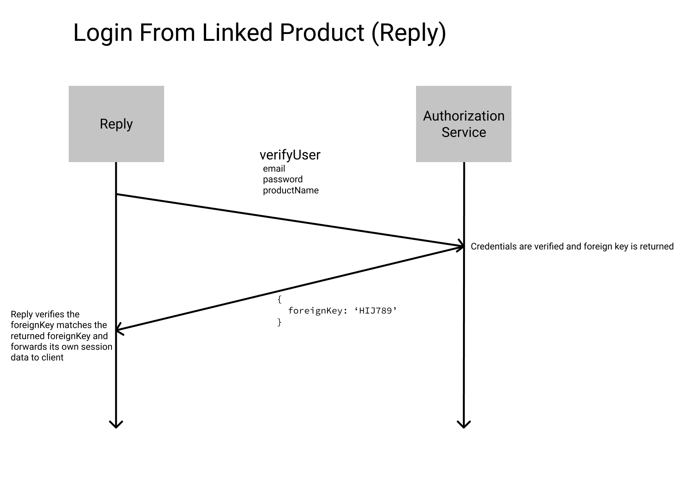
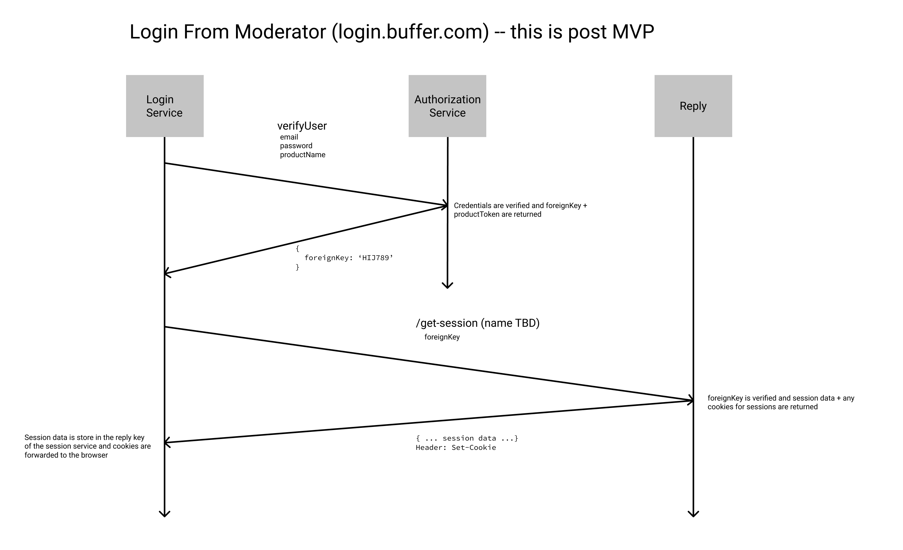

# Authentication Service

Buffer Authentication Service

## Model

```js
{
  _id: ObjectId('some_mongo_id')
  email: 'admin@bufferapp.com', // unique
  password: 'one_way_hashed',
  productlinks: [
    productName: 'some_product_key',
    foreignKey: 'some_foreign_key',
  ],
  resetToken: 'some_reset_token',
  resetAt: new Date(),
  createdAt: new Date(),
  updatedAt: new Date(),
  lastLoginAt: new Date(),
}
```

## API

All endpoints are written as [@bufferapp/micro-rpc](https://github.com/hharnisc/micro-rpc) endpoints. If you're using JS there is a client: https://github.com/bufferapp/micro-rpc-client

```js
import RPCClient from 'micro-rpc-client'

const main = async () => {
  const rpc = new RPCClient({
    url: 'https://some.rpc.buffer.com/rpc',
  })
  const result = await rpc.call('createUser', {
    email: 'e@mail.com',
    password: 'password',
  })
  console.log('result:', result)
}

main()
```

Under the hood the library is generating a POST with JSON data:

```sh
curl -H "Content-Type: application/json" -X POST -d '{"name": "createUser", "args": "{\"password\":\"my password\",\"email\":\"e@mail.com\"}"}' https://some.rpc.buffer.com/rpc | python -m json.tool

# {
#    "result": ...
# }
```

### createUser

Creates a new user

**Input**

```js
rpc.call('createUser', {
  email: 'admin@bufferapp.com',
  password: 'some_password',
})
```

**Output**

```js
// success
// code: 200
{
  _id: 'some_mongo_id'
}
// fail -
//    missing/invalid email
//    missing/invalid password
// code: 400
{
  message: 'email|password is a required parameter'
}
```

### getUser

Gets an account information

**Input**

```js
rpc.call('getUser', {
  email: 'admin@bufferapp.com',
  // or
  _id: 'some_mongo_id'
})
```

**Output**

```js
// success
// code: 200
{
  _id: 'some_mongo_id',
  email: 'admin@bufferapp.com',
  resetAt: new Date(),
  createdAt: new Date(),
  updatedAt: new Date(),
  lastLoginAt: new Date(),
  productlinks: [
    {
      productName: 'some_product_key',
      foreignKey: 'some_foreign_key',
    }
  ]
}

// fail -
//    missing email
//    missing \_id
// code: 400
{
  message: '_id or email must be specified'
}

// fail -
//    couldn't find a user
// code: 400
{
  message: 'Could not find user with query: ...'
}
```

### createProductlink

Creates (or overwrites) a link between the authentication service and an external service

**Input**

```js
rpc.call('createProductlink', {
  email: 'admin@bufferapp.com',
  // or
  id: 'some_mongo_id',
  // and
  productName: 'reply',
  foreignKey: 'some_foreign_key'
})
```

**Output**

```js
// success
// code: 200
{
  success: true,
}

// fail -
//    missing email
//    missing id
//    missing productName
//    missing foreignKey
// code: 400
{
  message: 'Please specify a ...'
}

// fail -
//    can't find user
// code: 400
{
  message: 'Could not create product link for ...'
}
```

### removeProductlink

Removes a link between the authentication service and an external service

**Input**

```js
rpc.call('removeProductlink', {
  email: 'admin@bufferapp.com',
  // or
  id: 'some_mongo_id',
  // and
  productName: 'reply',
})
```

**Output**

```js
// success
// code: 200
{
  success: true
}

// fail -
//    missing email
//    missing id
//    missing productName
// code: 400
{
  message: 'Please specify a ...'
}

// fail -
//    can't find user
// code: 400
{
  message: 'Could not remove product link from ...'
}
```

### updatePassword

Updates an existing accounts password (requires existing password)

**Input**

```js
rpc.call('removeProductlink', {
  email: 'admin@bufferapp.com',
  // or
  id: 'some_mongo_id',
  // and
  password: 'some_password',
  newPassword: 'some_new_password'
})
```

**Output**

```js
// success
// code: 200
{
  success: true
}

// fail -
//    missing email
//    missing id
//    missing password
//    missing newPassword
// code: 400
{
  message: 'Please specify a ...'
}

// fail -
//    newPassword === password
// code: 400
{
  message: 'password and newPassword cannot match'
}

// fail -
//    can't find user
// code: 400
{
  message: 'Could not update account with ...'
}
```

### startPasswordReset

Initiates a password reset flow

_NOTE: this does not send an email, just creates a expirable token that can be used to set the password_

**Input**

```js
rpc.call('startPasswordReset', {
  email: 'admin@bufferapp.com',
  // or
  id: 'some_mongo_id'
})

```

**Output**

```js
// success
// code: 200
{
  resetToken: 'some_reset_token'
}

// fail -
//    missing email
//    missing \_id
// code: 400
{
  message: '_id or email must be specified'
}

// fail -
//    can't find user
// code: 400
{
  message: 'Could not start password reset on account with ...'
}
```

### api/password/reset/complete

Completes a password reset flow

_NOTE: this does not send an email, just takes a expirable token that can be used to set the password_

**Input**

```js
{
  email: 'admin@bufferapp.com',
  // or
  id: 'some_mongo_id',
  // and
  resetToken: 'some_reset_token',
  password: 'some_new_password'
}
```

**Output**

```js
// success
// code: 200
{
  success: true
}
// fail -
//    invalid email
//    invalid id
//    invalid/missing/expired reset token
//    invalid/missing password
// code: 400
{
  success: false,
  message: 'Could not reset password'
}
// fail -
//    invalid password
// code: 400
{
  success: false,
  message: 'Invalid password'
}
// fail -
//    expired reset token
// code: 400
{
  success: false,
  message: 'Password reset expired'
}
```

### api/verify

Verify authenticity with an email and password -- requires a product to be linked

**Input**

```js
{
  email: 'admin@bufferapp.com',
  // or
  id: 'some_mongo_id',
  // and
  password: 'some_password',
  productName: 'reply'
}
```

**Output**

```js
// success
// code: 200
{
  success: true,
  foreignKey: 'some_foreign_key'
}
// fail - password + email combo
// code: 400
{
  success: false,
  message: 'Could not authenticate with credentials'
}

// fail - productName invalid
// code: 401
{
  success: false,
  message: 'Invalid product credentials'
}
```

## Environement Variables

```js
{
  RESET_TIMEOUT: 300, // seconds
  MONGO_URL:some_mongo_url,
}
```

## Network Diagrams





