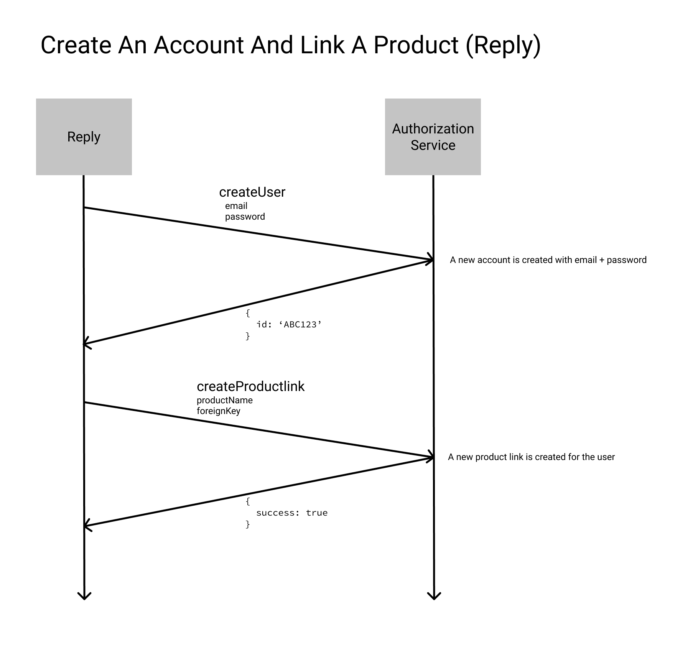

# Authentication Service

Buffer Authentication Service

## Model

```js
{
  _id: ObjectId('some_mongo_id')
  email: 'admin@bufferapp.com', // unique
  password: 'one_way_hashed',
  productlinks: [
    {
      key: 'some_product_key',
      token: 'some_product_token', // send this with username and password to authenticate
      foreignKey: 'some_foreign_key' // link to a product resource
    }
  ],
  resetToken: 'some_reset_token',
  resetAt: new Date(),
  createdAt: new Date(),
  updatedAt: new Date(),
  lastLoginAt: new Date(),
  data: {} // bucket of any data we'll want to persist (future proofing)
}
```

## API

All of these requests are POST and parameters are passed in the request body.

### api/create

Creates an new account

**Input**

```js
{
  // and
  email: 'admin@bufferapp.com',
  password: 'some_password',
  // optional
  data: {}
}
```

**Output**

```js
// success
// code: 200
{
  success: true,
  id: 'some_mongo_id'
}
// fail -
//    missing/invalid email
//    missing/invalid password
// code: 400
{
  success: false,
  message: 'Could not create account'
}
// fail -
//    invalid data -- must be undefined or object
// code: 400
{
  success: false,
  message: 'Data must be an object'
}
```

### api/get

Gets an account information

**Input**

```js
{
  email: 'admin@bufferapp.com',
  // or
  id: 'some_mongo_id'
}
```

**Output**

```js
// success
// code: 200
{
  success: true,
  email: 'admin@bufferapp.com',
  resetAt: new Date(),
  createdAt: new Date(),
  updatedAt: new Date(),
  lastLoginAt: new Date(),
  data: {}
}
// fail -
//    missing/invalid email
//    missing/invalid id
// code: 400
{
  success: false,
  message: 'Could not find account'
}
```

### api/productlinks/create

Creates (or overwrites) a link between the authentication service and an external service

**Input**

```js
{
  email: 'admin@bufferapp.com',
  // or
  id: 'some_mongo_id',
  // and
  productName: 'reply',
  foreignKey: 'some_foreign_key'
}
```

**Output**

```js
// success
// code: 200
{
  success: true,
  productToken: 'some_product_token'
}
// fail -
//    missing/invalid email
//    missing/invalid id
//    missing/invalid productName
//    missing/invalid foreignKey
// code: 400
{
  success: false,
  message: 'Could not create product link'
}
```

### api/productlinks/remove

Removes a link between the authentication service and an external service

**Input**

```js
{
  email: 'admin@bufferapp.com',
  // or
  id: 'some_mongo_id',
  // and
  productName: 'reply'
}
```

**Output**

```js
// success
// code: 200
{
  success: true
}
// fail -
//    missing/invalid email
//    missing/invalid id
//    missing/invalid productName
// code: 400
{
  success: false,
  message: 'Could not remove product link'
}
```

### api/password/update

Updates an existing accounts password (requires existing password)

**Input**

```js
{
  email: 'admin@bufferapp.com',
  // or
  id: 'some_mongo_id',
  // and
  password: 'some_password',
  newPassword: 'some_new_password'
}
```

**Output**

```js
// success
// code: 200
{
  success: true
}
// fail -
//    missing/invalid email
//    missing/invalid id
//    missing password
//    missing newPassword
// code: 400
{
  success: false,
  message: 'Could not update password'
}
// fail -
//    invalid newPassword
// code: 400
{
  success: false,
  message: 'New password is invalid'
}
```

### api/password/reset/start

Initiates a password reset flow

_NOTE: this does not send an email, just creates a expirable token that can be used to set the password_

**Input**

```js
{
  email: 'admin@bufferapp.com',
  // or
  id: 'some_mongo_id'
}
```

**Output**

```js
// success
// code: 200
{
  success: true,
  resetToken: 'some_reset_token'
}
// fail - email or id
// code: 400
{
  success: false,
  message: 'Could not start reseting password'
}
```

### api/password/reset/complete

Completes a password reset flow

_NOTE: this does not send an email, just takes a expirable token that can be used to set the password_

**Input**

```js
{
  email: 'admin@bufferapp.com',
  // or
  id: 'some_mongo_id',
  // and
  resetToken: 'some_reset_token',
  password: 'some_new_password'
}
```

**Output**

```js
// success
// code: 200
{
  success: true
}
// fail -
//    invalid email
//    invalid id
//    invalid/missing/expired reset token
//    invalid/missing password
// code: 400
{
  success: false,
  message: 'Could not reset password'
}
// fail -
//    invalid password
// code: 400
{
  success: false,
  message: 'Invalid password'
}
// fail -
//    expired reset token
// code: 400
{
  success: false,
  message: 'Password reset expired'
}
```

### api/verify

Verify authenticity with an email and password -- requires a product to be linked

**Input**

```js
{
  email: 'admin@bufferapp.com',
  // or
  id: 'some_mongo_id',
  // and
  password: 'some_password',
  productName: 'reply',
  productToken: 'some_product_token'
}
```

**Input - Moderator Application (login.buffer.com)**

```js
{
  email: 'admin@bufferapp.com',
  // or
  id: 'some_mongo_id',
  // and
  password: 'some_password',
  productName: 'reply',
  moderatorName: 'login',
  moderatorSecret: 'some_moderator_secret'
}
```

**Output**

```js
// success
// code: 200
{
  success: true,
  foreignKey: 'some_foreign_key',
  productToken: 'some_product_token'
}
// fail - password + email combo
// code: 400
{
  success: false,
  message: 'Could not authenticate with credentials'
}

// fail - productName + productToken invalid
// code: 401
{
  success: false,
  message: 'Invalid product credentials'
}
```

## Environement Variables

```js
{
  RESET_TIMEOUT: 300, // seconds
  MODERATOR_APP_NAME: 'login',
  MODERATOR_APP_SECRET: 'some_moderator_secret'
}
```

## Network Diagrams


